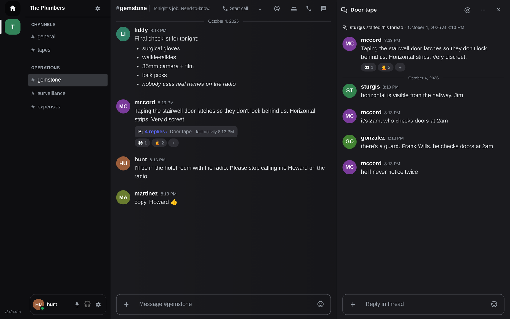
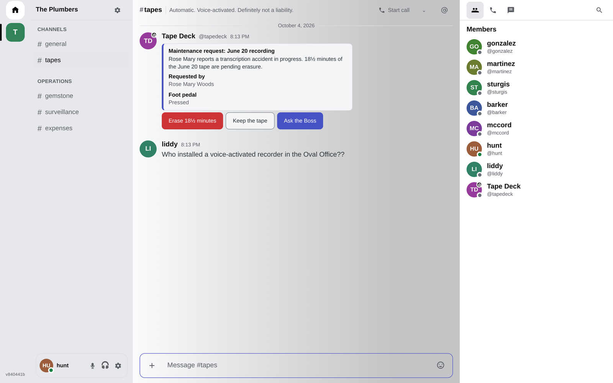
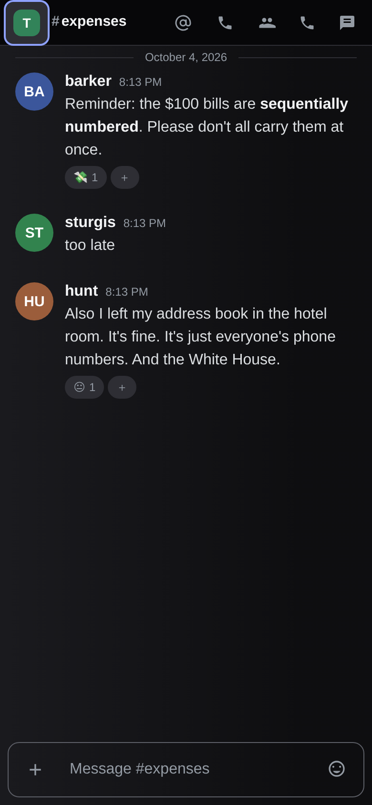

# Hrmny

[](LICENSE) 

Hrmny is a self-hostable, real-time team chat platform built on
**Elixir/BEAM and ScyllaDB**. It is shaped like Discord (workspaces, channels,
threads, presence, mentions, voice) and aimed at small-to-medium teams that
want that speed and structure on a server they run themselves, with
first-party accounts and no federation.

One Phoenix server speaks REST plus a compressed WebSocket gateway. Every
client (the web app/PWA, a Tauri desktop shell, a React Native mobile app and
a terminal client reached over SSH) is built on **one shared TypeScript
protocol core**, and bots can use existing Discord libraries through a
Discord-compatible API surface.

Hrmny is an independent project, not affiliated with or endorsed by
Discord Inc.

> **Naming.** Hrmny is the product name. Internal identifiers still use the
> project's former codename, `cytale`: the `@cytale/*` packages, `CYTALE_*`
> environment variables, the Elixir app `:cytale`, the `cytale` keyspace and
> the `cytale://` deep-link scheme. A rename is planned.

## Screenshots

<p>
  
</p>
<p>
  
  &nbsp;
  
</p>

*The demo workspace is fiction: a satirical 1972 "Plumbers" chat, made up for
these screenshots.*

## Status

Beta. The core product is complete and in daily use on the maintainers' own
deployment. Expect rough edges, schema changes that need a one-off step (they
are called out in [docs/self-hosting.md](docs/self-hosting.md)), and a wire
protocol that is versioned but still evolving
([docs/protocol/versioning.md](docs/protocol/versioning.md)).

A public instance you can sign up to and try without running a server is
planned, with no ETA yet. For now, Hrmny means hosting it yourself
([docs/self-hosting.md](docs/self-hosting.md)).

Bugs and feature
requests go to the [issue tracker](https://github.com/jrimmer/hrmny/issues).

## Features

- **Workspaces, channels, categories, threads and DMs**, with Discord-aligned
  permission semantics (a permission bitfield resolved per channel and a
  strict role hierarchy).
- **Real-time gateway**: an op-code protocol with zstd/zlib compression,
  heartbeats, single-use resume tokens, gap detection and reconnect-storm
  damping.
- **Messages**: a CommonMark + GFM dialect with a Lexical composer,
  @mentions, reactions, attachments (content-addressed, signed URLs), an
  external-image media proxy, edit/delete, permalinks and "Remind me" marks.
- **Presence, typing and per-user unread state**, with a notification model
  built on exceptions (mute, mentions-only) rather than per-channel inventory.
- **Search**: full-text message search (Tantivy embedded in the BEAM),
  `from:`/`in:`/date filters, a people directory and a Cmd-K omnisearch.
- **Voice and video calls with screen sharing**: WebRTC media terminated in
  the server (ex_webrtc), with an eturnal TURN relay for restrictive networks.
- **Accounts**: username-or-email + password (argon2id), passkeys (WebAuthn),
  optional single sign-on through one OIDC provider, email verification, JWT
  access tokens with rotating refresh tokens, and invite-only sign-up by
  default.
- **Clients**:
  - a React 19 **web app** that installs as a **PWA** (offline shell, Web
    Push);
  - a **Tauri 2 desktop** shell hosting the same UI with native
    notifications;
  - a **React Native (Expo) mobile** app;
  - a **terminal client** reached with plain `ssh` through a Go SSH host that
    authenticates members with short-lived SSH certificates.
- **Bots and integrations**: bots, personal agents and webhooks are
  first-class sub-identities with narrow delegated rights and instant
  revocation. A **Discord-compatible surface** (`/api/v10` REST plus a
  gateway dialect with intents) lets unmodified discord.js and discord.py
  bots connect. Slash commands, interactive components (buttons, select
  menus, modals), embeds, and Discord-compatible **incoming webhooks**
  (plain, `/slack` and `/github` variants) are supported. See
  [docs/protocol/compat.md](docs/protocol/compat.md).
- **Operations**: single-node Docker Compose deployment behind Caddy
  (automatic TLS), in-app backup and restore, Prometheus metrics, per-account
  and per-IP rate limits, and an admin API.

## Architecture

```
apps/
  server/       Phoenix (backend only, no LiveView): REST /api/v1, the WebSocket
                gateway, the Discord-compatible /api/v10 surface, calls/media,
                ScyllaDB via Xandra, Tantivy search via the muninn NIF
  web/          React 19 SPA + PWA (Vite, Tailwind v4, Radix primitives,
                Lexical composer, react-virtuoso scrollback, zustand)
  desktop/      Tauri 2 shell hosting the built web app
  mobile/       React Native / Expo app
  tui/          Terminal client (Ink); runs locally or behind the SSH host
  ssh-host/     Go SSH server: verifies member certificates and runs one
                terminal client per session, bridged to the app
packages/       Shared TypeScript core, the single wire-format source
  protocol/        wire types + encode/decode (gateway ops, events, REST shapes)
  api-client/      typed REST client
  gateway-client/  WebSocket gateway client (resume, gap detection, compression)
  state/           headless client state store (gateway events + REST reads)
  domain/          shared domain models and client-side permission resolution
  session/         auth/session lifecycle shared by web and mobile
  calls/           call/media engine shared by every client
  markdown/        one inline markdown parser, per-platform renderers
  emoji/           composer emoji catalog and preferences
tools/          protocol conformance check, Discord-compat checks, smoke, soak
                and the multi-client load harness
deploy/         Caddyfile, eturnal (TURN) config, local compose override
docs/           self-hosting guide, protocol reference, architecture notes
```

| Layer | Technology |
|---|---|
| Backend | Elixir ~> 1.18 / OTP 27, Phoenix 1.8 (Bandit), backend only |
| Database | ScyllaDB (Xandra driver, LOCAL_QUORUM, `(channel_id, bucket)` message partitions, snowflake ids) |
| Search | Tantivy embedded in the BEAM (muninn NIF, Rustler), per-workspace indexes |
| Realtime | Custom WebSocket gateway, zstd/zlib compression, resumable sessions |
| Calls | ex_webrtc in the server, eturnal TURN |
| Web | React 19, TypeScript, Vite, vite-plugin-pwa, Tailwind v4, Radix, Lexical, react-virtuoso |
| Desktop / mobile / terminal | Tauri 2 · React Native + Expo · Ink over a Go SSH host |
| Tooling | pnpm workspaces + Turborepo, Vitest, Jest, ExUnit, Playwright, axe-core |

Further reading:
[docs/architecture/protocol.md](docs/architecture/protocol.md),
[docs/architecture/platform-clients.md](docs/architecture/platform-clients.md),
[docs/architecture/product-invariants.md](docs/architecture/product-invariants.md)
and the wire reference in [docs/protocol/](docs/protocol/README.md).

## Self-hosting quickstart

You need a Linux host with Docker Engine and the compose plugin, a DNS name
pointing at it (here `chat.example.com`), ports 80 and 443 open, and about
4 GB of free RAM.

```bash
git clone https://github.com/jrimmer/hrmny.git && cd hrmny
cp .env.example .env
# Fill in .env: SECRET_KEY_BASE, AUTH_JWT_SECRET and AUTH_REFRESH_PEPPER
# (e.g. `openssl rand -base64 48` each), CYTALE_DOMAIN=chat.example.com
# and ACME_EMAIL.
docker compose pull      # ghcr.io/jrimmer/hrmny and ghcr.io/jrimmer/hrmny-ssh-host
docker compose up -d
curl -fsS https://chat.example.com/health
```

Compose runs ScyllaDB, the app, Caddy (TLS via Let's Encrypt), an eturnal
TURN server for calls, and the SSH host for the terminal client (off until you
provision it). Sign-up is invite-only by default.
[docs/self-hosting.md](docs/self-hosting.md) covers the rest: prerequisites
(including the ScyllaDB AIO sysctl), secrets, the mailer, sign-up, OIDC, rate
limits, backups, Web Push, voice/TURN ports, the SSH host, desktop builds for
your own server, and rollback by pinning `CYTALE_IMAGE=ghcr.io/jrimmer/hrmny:<tag>`.

## Development

### Toolchain

- **Elixir ~> 1.18** on **Erlang/OTP 27**
- **Rust ~> 1.92** (the muninn search NIF and the Tauri desktop shell)
- **Node.js 22+** and **pnpm 11** (pinned by `packageManager` in
  `package.json`; `corepack enable` picks it up)
- **Go** at the version in `apps/ssh-host/go.mod` (only for the SSH host)
- **Docker**, to run a development ScyllaDB

### A development database

Run ScyllaDB in Docker, exactly like this:

```bash
docker run -d --name cytale-scylla --restart unless-stopped --memory 3g \
  -p 127.0.0.1:9042:9042 -v cytale_scylla_dev:/var/lib/scylla \
  scylladb/scylla:2026.2.6 \
  --developer-mode=1 --smp=2 --memory=1200M --overprovisioned=1 \
  --tablets-mode-for-new-keyspaces=disabled
```

`--tablets-mode-for-new-keyspaces=disabled` is required: the schema uses
SimpleStrategy, which tablet mode rejects. On Linux, raise the AIO limit if
the node will not boot (`sudo sysctl -w fs.aio-max-nr=1048576`).

ScyllaDB loads every keyspace's metadata at boot, so its startup time grows
with the total number of tables across all keyspaces. If leftover test
keyspaces pile up (a hard-killed test run cannot clean up after itself),
`scripts/scylla-reset.sh` lists them and `scripts/scylla-reset.sh --apply`
drops them. Development boots log a warning when the keyspace count gets high.

### Run it

```bash
pnpm install

# Terminal 1: the server on :4000. The schema is applied (idempotently) and
# verified at boot; verification emails go to a local dev mailbox file.
./scripts/dev.sh --server

# Terminal 2: the web app on http://localhost:5173 with hot reload,
# proxying /api and /gateway to :4000.
./scripts/dev.sh

# Optional
cd apps/desktop && pnpm tauri dev   # desktop shell against the local server
cd apps/mobile && pnpm start        # Expo dev server
```

### Tests

```bash
pnpm typecheck                              # every TypeScript workspace
pnpm --filter @cytale/web test              # web (Vitest)
pnpm --filter @cytale/mobile test           # mobile (Jest)
pnpm --filter @cytale/tui test              # terminal client (Vitest)
pnpm --filter "./packages/*" test           # shared packages (Vitest)
pnpm protocol:check                         # wire protocol: docs vs server vs clients

cd apps/server && mix test                  # server, full run (needs ScyllaDB)
cd apps/server && CYTALE_TEST_NO_DB=1 mix test   # server, database-free PARTIAL run
cd apps/server && mix format --check-formatted
cd apps/ssh-host && go test ./...
```

Without a reachable ScyllaDB (or with `CYTALE_TEST_NO_DB=1`), `mix test`
excludes every `:scylla`-tagged test and prints a PARTIAL-run banner. A green
database-free run is never a full run. Two suites running at once against the
same node must each take their own keyspace and port:
`CYTALE_TEST_KEYSPACE=<unique> CYTALE_TEST_PORT=<unique> mix test`.

The web app's fixture-backed end-to-end specs need only a Vite dev server
(start `pnpm exec vite --port 5173` in `apps/web`, then
`pnpm exec playwright test` there). `pnpm compat:check` runs a real
discord.js client against a server it starts from the checkout.

## Contributing

Contributions are welcome. Read [CONTRIBUTING.md](CONTRIBUTING.md) for the
workflow (conventional commits, `Release-note:` trailers, DCO sign-off, the
accessibility bar) and [AGENTS.md](AGENTS.md) if you work with a coding
agent. Everyone taking part is expected to follow the
[Code of Conduct](CODE_OF_CONDUCT.md).

Please report security issues privately as described in
[SECURITY.md](SECURITY.md), not in the public tracker.

## Acknowledgements

Hrmny stands on a lot of other people's work. Thank you to the authors and
maintainers of:

**Design**

- [Starbase](https://starbase.zweiundeins.gmbh/themes) by zweiundeins: the
  8/16-bit design language, theme tokens and pixel styling that Hrmny's
  *Pixel* style is built on and that inspired its *Daylight* palette.
  Starbase's components are MIT-licensed by their authors.
- [shadcn/ui](https://ui.shadcn.com): the component conventions and
  CSS-variable theming model our token layer follows.
- [Radix UI](https://www.radix-ui.com) primitives,
  [Tailwind CSS](https://tailwindcss.com), [Lucide](https://lucide.dev)
  icons and [cmdk](https://cmdk.paco.me).

**Clients**

- [React](https://react.dev), [Vite](https://vite.dev) and
  [vite-plugin-pwa](https://vite-pwa-org.netlify.app).
- [Lexical](https://lexical.dev), the composer and message editor.
- [react-virtuoso](https://virtuoso.dev), the message scrollback.
- [Zustand](https://zustand.docs.pmnd.rs), client state.
- [Tauri](https://tauri.app), the desktop app.
- [Expo](https://expo.dev) and [React Native](https://reactnative.dev), with
  [FlashList](https://shopify.github.io/flash-list/), for mobile.
- [Ink](https://github.com/vadimdemedes/ink), the terminal client.

**Server**

- [Elixir](https://elixir-lang.org), [Erlang/OTP](https://www.erlang.org),
  [Phoenix](https://www.phoenixframework.org) and
  [Bandit](https://github.com/mtrudel/bandit).
- [ScyllaDB](https://www.scylladb.com) and the
  [Xandra](https://github.com/whatyouhide/xandra) driver.
- [Tantivy](https://github.com/quickwit-oss/tantivy) search, embedded through
  [muninn](https://github.com/nyo16/muninn) and
  [Rustler](https://github.com/rusterlium/rustler).
- [ex_webrtc](https://github.com/elixir-webrtc/ex_webrtc) and
  [eturnal](https://eturnal.net) for calls.
- [Caddy](https://caddyserver.com), the reverse proxy.

**Tooling**

- [pnpm](https://pnpm.io), [Turborepo](https://turborepo.com),
  [Vitest](https://vitest.dev), [Jest](https://jestjs.io),
  [Playwright](https://playwright.dev) and
  [axe-core](https://github.com/dequelabs/axe-core).

Hrmny's bot API is compatible with [Discord](https://discord.com)'s so that
existing bot libraries work unchanged. Hrmny is not affiliated with or
endorsed by Discord.

## License

[BSD-3-Clause](LICENSE). Copyright The Hrmny contributors.
